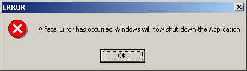



## Application error JOKE

### Description

It basically displays a error message

read the readme.txt file! it has directions on how to use this...
 
### More Info
 
NO!

it is just a joke!

none...

             |
---                |---
**Submitted On**   |2000-08-06 13:57:58
**By**             |[Jack Peterson](https://github.com/Planet-Source-Code/PSCIndex/blob/master/ByAuthor/jack-peterson.md)
**Level**          |Intermediate
**User Rating**    |3.8 (15 globes from 4 users)
**Compatibility**  |VB 5\.0, VB 6\.0
**Category**       |[Complete Applications](https://github.com/Planet-Source-Code/PSCIndex/blob/master/ByCategory/complete-applications__1-27.md)
**World**          |[Visual Basic](https://github.com/Planet-Source-Code/PSCIndex/blob/master/ByWorld/visual-basic.md)
**Archive File**   |[CODE\_UPLOAD8672862000\.zip](https://github.com/Planet-Source-Code/jack-peterson-application-error-joke__1-10460/archive/master.zip)

### API Declarations

NONE!

